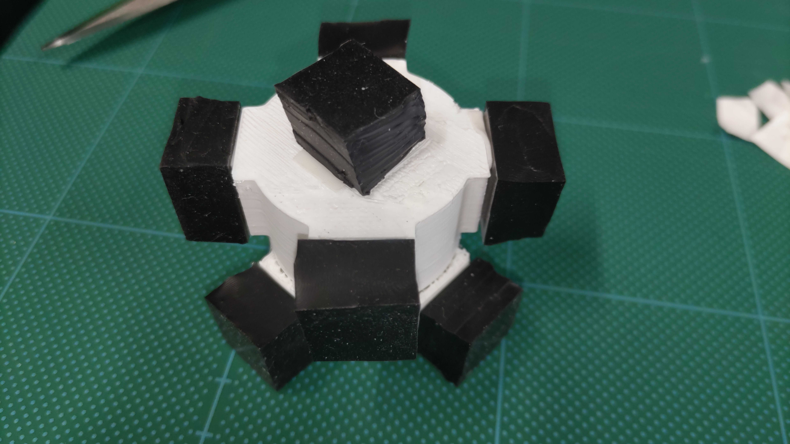

# How to make Soft-Jig
## Parts List
- Pestle and Mortar: Asone Ceramic Mortar, Deep Type, 80[mm]x100[mm]x32[mm] Depth
  - https://axel.as-1.co.jp/asone/d/2-888-05/
- Bearing: NTN 608ZZ
- Spatula: Sato Metal Industrial Silicone Rubber Spatula, Size S
- Gel: MISUMI Super Low Hardness Urethane, Sheet Type, Thickness 10mm
  - https://jp.misumi-ec.com/vona2/detail/110300278970/?HissuCode=SUTLLA&PNSearch=SUTLLA&KWSearch=SUTLLA&searchFlow=results2products&list=PageSearchResult
- Adhesive: Aron Alpha EXTRA Quick Multipurpose

## List of Fixtures to be Printed with 3D Printer (1 each)
- Mortar
  - Mortar_case_on_optical_bench.stl (When using optical bench)
  - Mortar_case_on_aluminum_frame_8series.stl (When using aluminum frame)
- Pestle
  - Pestle_inner_cage.stl
  - Pestle_outer_cage.stl
- Bearing
  - Bearing_cover.stl
- Spatula
  - Spatula_jig.stl

## Instructions for Making Soft-Jig
1. Cut the gel into a size of 15[mm] x 15[mm] x thickness 10[mm] with scissors, and adhere it to the Inner_cage with adhesive.

2. Insert the Inner_cage into the Outer_cage.
3. Secure the Bearing by screwing the Bearing_cover onto the Outer_cage.
4. Fit only the silicone part at the tip of the Spatula into the Spatula_jig, and insert it into the Bearing to complete.

## Operational Notes
- If the surface of the Spatula has poor slip, it may hinder the collection of powder. Please use a Unipack (40mm width of S-4), or wrap it with medicine wrapping paper and fix it with tape.
- The Pestle and Spatula_jig may not fit well if there are gaps. Please use vinyl tape or seal tape to fill the gaps (vinyl tape is recommended for the Pestle as higher friction is preferable).