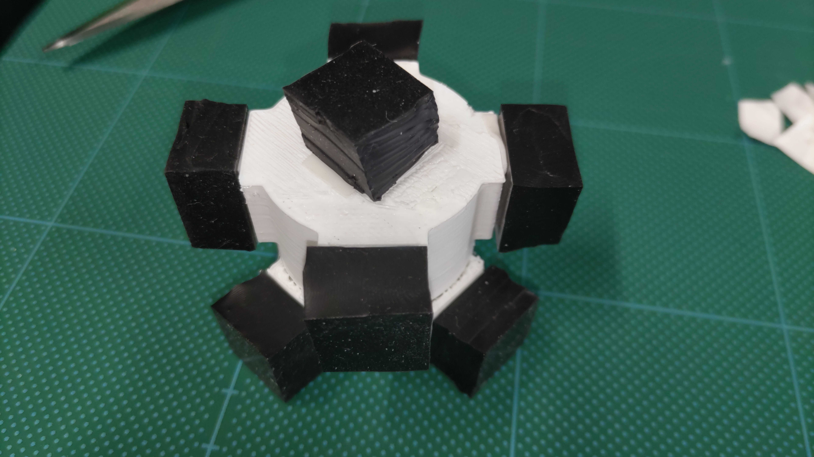

# ソフト治具の作り方

## 部品一覧
- 乳棒, 乳鉢 ：Asone メノウ乳鉢 深型 80[mm]x100[mm]x深さ32[mm]
  - https://axel.as-1.co.jp/asone/d/2-888-05/
- ベアリング：NTN 608ZZ
- ヘラ：佐藤金属興業 シリコンゴムヘラ Sサイズ
- ゲル：MISUMI 超低硬度ウレタン　シートタイプ　厚み10mm
  - https://jp.misumi-ec.com/vona2/detail/110300278970/?HissuCode=SUTLLA&PNSearch=SUTLLA&KWSearch=SUTLLA&searchFlow=results2products&list=PageSearchResult
- 接着剤：アロンアルファ EXTRA 速攻多用途
- よく切れるハサミ(ゲルシートの切断はカッターよりもハサミが便利です)

## 3Dプリンタで印刷する治具の一覧(各1個づつ)
- 乳鉢
  - Mortar_case_on_optical_bench.stl(When using optical bench)
  - Mortar_case_on_aluminum_frame_8series.stl(When using aluminium_frame)
- 乳棒
  - Pestle_inner_cage.stl
  - Pestle_outer_cage.stl
- ベアリング
  - Bearing_cover.stl
- ヘラ
  - Spatula_jig.stl

## Soft-Jigの作り方
1. ゲルを15[mm] x 15[mm] x 厚み10[mm]のサイズにハサミで切り出し、接着剤でInner_cageに張り付ける

2. Outer_cageにInner_cageを挿入
3. ベアリングはBearing_coverをOuter_cageにねじ止めして固定
4. ヘラは先端のシリコン部分だけをSpatula_jigにはめて、ベアリングに差し込んで完成

## 運用上の注意
- ヘラの表面のすべりが悪いと粉の回収に支障が出るので、ユニパック(S-4の40mm幅のもの)をかぶせる、もしくは薬包紙で巻いてテープで止めるなどをして使ってください。
- 乳棒、Spatula_jigは隙間があるとうまくはまりません。隙間埋めにビニールテープやシールテープを使ってください(乳棒は摩擦が大きい方がよいのでビニールテープがおススメ)。